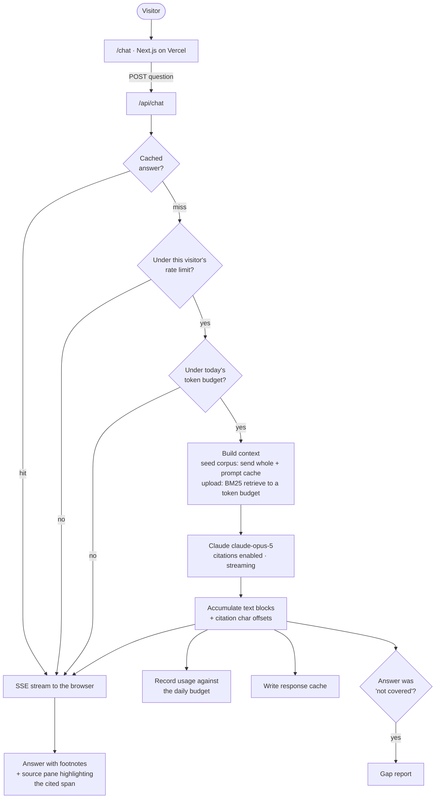

# AI Demo Lab

Working demos of AI systems, built code-first. Three of them share one Next.js
app, one design system, and one spend guard; each has its own route and its own
portfolio link.

| Demo | Route | Status |
| --- | --- | --- |
| Support agent with real citations | `/chat` | Live |
| Invoice & document extraction | `/extract` | Planned |
| Content repurposing engine | `/repurpose` | Planned |

All three are built around **Kestrel**, a fictional project-management SaaS, so
the pieces read as one product suite rather than three unrelated toys.

---

## Demo 1 — Support agent with real citations

Answers customer questions from a six-document help center. What separates it
from a wrapper around a chat completion:

- **Citations are exact character spans, produced by the API** — not references
  the model wrote out. Click a footnote and the source pane scrolls to and
  highlights the precise sentence. A citation here cannot point at something
  the source doesn't say.
- **It declines.** When the docs don't cover a question it says so and offers a
  human, instead of producing a fluent guess. Two questions in the UI exist
  purely to demonstrate this.
- **Refusals become a work item.** Every "I don't know" is logged to a
  [content gap report](#the-gap-report) ranked by frequency — the backlog of
  docs nobody has written yet, generated as a side effect of running the bot.
- **It survives being public.** Response cache, per-visitor rate limit, and a
  daily token budget, all in front of the model.

### Architecture



### The decisions worth explaining

**Native citations rather than hand-rolled ones.** Each source is sent as a
`document` content block with `citations: {enabled: true}`. The response comes
back as several text blocks, each carrying the character ranges it drew on.
That is why the highlight is exact, and why the model cannot invent a source.
The constraint this buys: citations are incompatible with structured outputs,
so the answering path can't use `output_config.format` — which is why the
"I don't know" signal is a sentinel token in the text rather than a JSON field.

**Context strategy is chosen by corpus size, and that's the point.**
The seed corpus is small, so it is sent *whole* with a cache breakpoint on the
last block. That answers better than retrieval — the model sees every document,
so "none of these cover it" is a conclusion it can actually reach rather than
an artifact of a bad retrieval hit — and the repeated prefix means later
questions read it from cache at roughly a tenth of the input price. An uploaded
document is an unknown size, so it gets chunked and retrieved with BM25 against
a token budget instead. Same code path, different strategy, picked for a
reason.

**BM25 rather than embeddings.** No vector database, no embeddings provider, no
second API key — a few hundred lines of scoring that runs in-process. For a
corpus this size the quality difference doesn't justify the operational
surface. At a scale where it does, the retrieval module is the only thing that
changes.

**The spend guard is a feature, not a disclaimer.** The response cache is a real
cache: the first visitor to ask a question pays for it, everyone after reads
the stored answer. That is why the suggested questions stay instant even after
the budget is spent. Rate limiting and the daily budget sit behind it, and a
cache hit deliberately bypasses both — serving it costs nothing, so there's
nothing to ration.

**Uploads are text-only, on purpose.** The API reads PDFs natively, but their
citations come back as page numbers rather than character offsets, so the
click-a-citation-and-see-the-sentence behaviour would quietly stop working. A
demo that accepts more formats but delivers less is a worse demo.

### Known scope limits

Stated plainly, because a demo that hides them is less trustworthy than one
that doesn't:

- **No conversation memory.** Each question is answered independently against
  the corpus. Follow-ups like "what about on the Team plan?" won't resolve the
  pronoun. Adding history means making the cache key include it, which is a
  real design change rather than a small one.
- **Answers render as plain text**, not markdown. The system prompt keeps
  answers short enough that this doesn't hurt, and it avoids shipping a
  markdown parser to render three sentences.
- **The gap report is unauthenticated.** Fine for a demo whose data is entirely
  visitor-typed questions; not something to copy into a product.

---

## Demo 2 — Invoice extraction you can audit

`/extract` — upload a PDF invoice, get structured rows out. Demo 1 argues an
answer is only as good as the source you can trace it to; demo 2 makes the same
argument about extracted data: **a field is only as good as the text you can
point at.**

Two independent checks decide whether a field is trustworthy, and neither asks
the model how confident it feels:

1. **Quote verification.** The schema requires a verbatim quote beside every
   value. The server confirms that quote appears in the PDF's extracted text and
   computes the character span itself. A quote that isn't there is a hard
   failure, not a low score.
2. **Arithmetic reconciliation.** Line items must multiply out, sum to the
   subtotal, and add with tax to the total — compared in integer minor units
   with a one-unit tolerance for rounding. This runs entirely independently of
   the model, so a confident, well-quoted, wrong total still gets caught.

Anything failing either check becomes an editable field. Correcting it re-runs
reconciliation instantly — the client imports the *same* `reconcile` the server
used, so a cleared flag means it's genuinely clear.

Three samples ship with the demo, so nobody has to upload a real invoice: one
clean, one whose stated total is 1,428.00 when subtotal plus tax is 1,296.00,
and one whose due date is never printed (terms say "Net 30") and therefore
can't be grounded.

### Why not the API's own citations?

Demo 1 anchors claims with character-span citations from the API. That
mechanism cannot be used here, which was verified against the live API rather
than assumed:

- Citations plus `output_config.format` returns **400** — *"Citations cannot be
  enabled when output format is set."*
- Citations plus a *forced* strict tool is accepted, but the response is a lone
  `tool_use` block. Citations attach to text blocks, so there are none. Legal,
  silent, and useless — a worse trap than the 400.
- PDF citations are **page-level** anyway. On a one-page invoice every citation
  would resolve to "page 1".

Computing spans ourselves from verified quotes is both possible and stronger.

### Known scope limits

- **Text-based PDFs only.** Scans return a 422 that says so. Images inside PDFs
  can't be read as text, and OCR is a different project.
- **Short quotes match loosely.** Verification is a substring search, so a
  one-character quote like `"2"` will find *something*. It holds up for the
  fields that matter (names, dates, amounts) and is weakest exactly where the
  stakes are lowest.
- **Nothing is stored.** No PDF, no extracted text, no result beyond a response
  cache keyed on the file's bytes. Invoice contents aren't anonymous the way the
  gap report's questions are, so a processed-invoice log would leak one
  visitor's vendors and amounts to the next.

---

## The gap report

`/chat/gaps` — every question the agent declined, ranked by how often it was
asked, with escalation counts.

This is the part a support team would actually keep. A bot that says "I don't
know" is only worth running if someone finds out *what* it didn't know, so the
refusal path writes here instead of disappearing into a log.

---

## Running it

```bash
npm install
cp .env.example .env.local   # add your ANTHROPIC_API_KEY
npm run dev
```

`ANTHROPIC_API_KEY` is the only thing required locally. Redis is optional in
development and falls back to process memory.

```bash
npm test        # unit tests for retrieval, citations, guard, highlighting, uploads
npm run build   # production build
```

### Deploying

1. Push to a repo and import it into Vercel. The free tier is enough.
2. Set `ANTHROPIC_API_KEY`.
3. Create a free Upstash Redis database and set `UPSTASH_REDIS_REST_URL` and
   `UPSTASH_REDIS_REST_TOKEN`.

**Redis is not optional in production.** Serverless functions share no memory,
so without it: the rate limiter counts per-instance and barely limits anything,
the daily budget under-counts, the gap report resets constantly, and uploads —
written by one request and read by the next — break outright. The upload
endpoint detects this case and refuses with a clear message rather than
appearing to work.

---

## Layout

| Path | What it is |
| --- | --- |
| `app/chat/` | The demo UI and the gap report page |
| `app/api/chat/` | Streaming answer endpoint — guard, context, Claude, SSE |
| `app/api/upload/`, `app/api/escalate/` | Visitor documents and the human handoff |
| `lib/citations.ts` | Folds the Anthropic stream into `{segments, citations}` |
| `lib/retrieval.ts` | BM25 scoring and token-budgeted selection |
| `lib/guard.ts` | Response cache keys, rate limit, daily token budget |
| `lib/highlight.ts` | Splits source text on citation spans for rendering |
| `lib/store.ts` | Redis, with an in-memory implementation for local dev |
| `content/kestrel/` | The seed help center — six markdown documents |
| `tests/` | Unit tests for all of the above |

Two of the seed questions are deliberately **not** covered by any document, so
the refusal path has something honest to demonstrate. A test asserts they stay
uncovered, so a future edit to the corpus can't quietly break the demo.

---

## Portfolio assets

| Path | What it is |
| --- | --- |
| `docs/CASE_STUDY.md` | Problem → approach → result, written to paste into a proposal |
| `docs/VIDEO_SCRIPT.md` | Shot-by-shot script for a 75-second demo recording |
| `assets/thumbnail-chat-upwork.html` | 1:1 thumbnail (grid and search results) |
| `assets/thumbnail-chat-upwork-wide.html` | 16:9 thumbnail — its own two-column layout, because cropping the square one cuts off the proof |
| `assets/render-thumbnails.ps1` | Renders both to PNG at every size Upwork uses |

```bash
pwsh assets/render-thumbnails.ps1
```

---

## Model configuration

| Setting | Value | Why |
| --- | --- | --- |
| Model | `claude-opus-5` | |
| Effort | `medium` | A grounded answer over six short documents isn't reasoning-heavy; this cuts latency and spend without a quality drop worth paying for |
| Thinking | left on (the default) | Disabling it invites tool calls emitted as plain text and `<thinking>` tags leaking into output — not worth a marginal saving |
| `max_tokens` | 3072 | Answers are short by design; the ceiling is a backstop |
| Caching | breakpoint on the last document block | The corpus is the stable prefix — that's what makes repeat questions cheap |

Verify caching is working: ask any question twice and watch
`cache_read_input_tokens` in the badge under the answer go from zero to the
size of the corpus.
